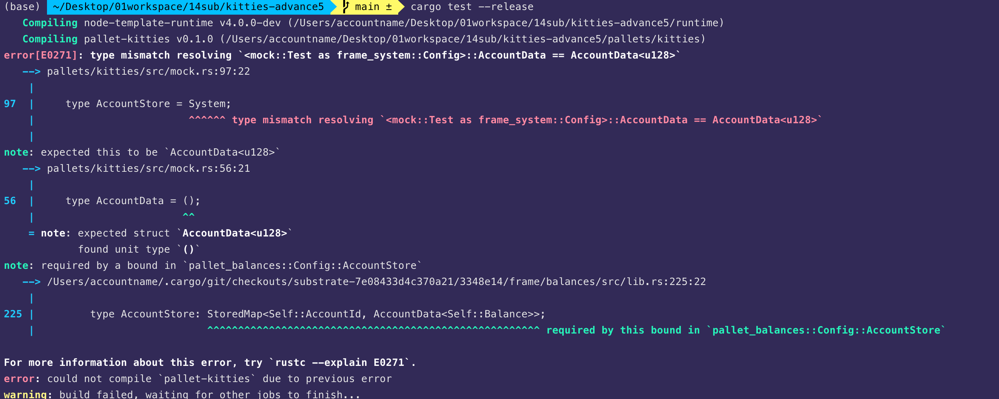

## 220913

### c1

为测试修改了一些代码，但仍有如图错误。之后再了解为什么 mock 里这些地方不能照抄 runtime，而是要改为 AccountData\<u128>。dfdda

### c2

c1 的做法错误，正确做法是将 type AccountData = () 换为 type AccountData = pallet_balances::AccountData\<Balance>\</Balance>。  
看错误提示，虽然提示没有说明之前要加 pallet_balances::，但是结合上下文，以及搜索查看提示所提到的 bound。就能推测出要写怎么写。dddi。

## 220914

### c3

解开 lib 中的 tests 标签后会报错，显示余额不足，参考别人的代码，在 fn new_test_ext()中设置添加余额的字段后则编译成功。部分内容不理解 dddf。

### c4

增加了两个 test，但想先增加 lib 中的 buy 和 sell 方法。再完成 tests。就先提交了

### c5

lib 中增加了 buy 和 sell 方法，dddi。

## 220915

### c6

增加了 tests

assert_ok 表示括号里返回是 ok，assert_eq 表示括号里左右值一样，assert_noop 表示括号左侧返回是 err，且具体 err 值跟右侧一样。  
想写完所有 tests 就把 lib 里每个 Error::\<T>::ErrorName 对应的 ErrorName 写一个带#[test]标签的 fn。
